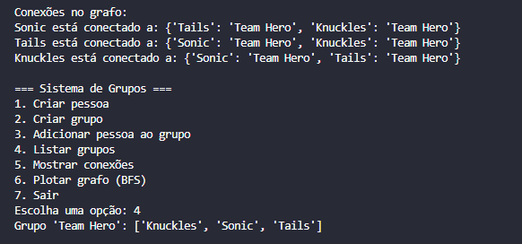
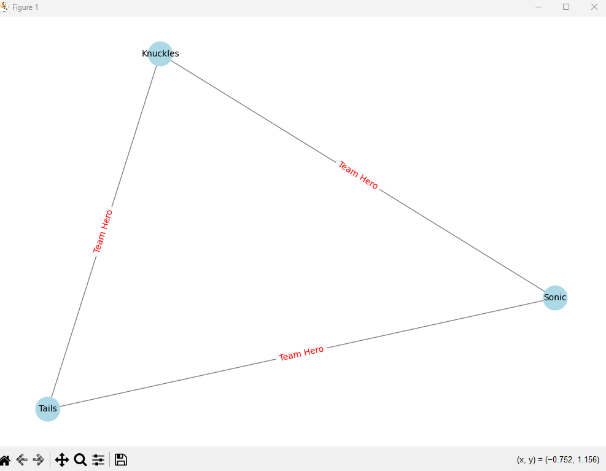

# Grafos1_SonicHeroes

<!-- **Número da Lista**: X  -->
**Conteúdo da Disciplina**: Grafos1 

## Alunos
|Matrícula | Aluno |
| -- | -- |
| 18/0015311  |  Danilo Domingo Vitoriano Silva |
| 20/0058576  |  Joao Victor Marques Reis de Miranda |

## Sobre 
Este projeto implementa um sistema de gerenciamento de grupos usando a estrutura de grafos, onde pessoas são representadas como vértices e suas conexões através de grupos são representadas como arestas. 

### Objetivos
- Criar um sistema que permita gerenciar grupos e suas conexões
- Visualizar as relações entre pessoas através de grafos
- Implementar busca em largura (BFS) para explorar conexões
- Fornecer uma interface interativa para manipulação dos dados

### Funcionalidades
- Criação de pessoas (vértices)
- Criação de grupos com múltiplos membros
- Adição de pessoas a grupos existentes
- Visualização das conexões entre pessoas
- Geração de grafo visual com algoritmo BFS
- Listagem de grupos e seus membros

## Screenshots

*Figura 1: Criação de Equipe*

*Figura 2: Listagem dos grupos criados e Conexões de Grafos*

*Figura 3: Visualização do grafo utilizando BFS*

## Instalação 
**Linguagem**: Python 

Foi utilizado o **Python 3.13**, juntamente com os bibliotecas **networkx** e **matplotlib**

Para instalar as bibliotecas utilize:

    pip install -r requirements.txt

## Uso 
Para rodar o projeto utilize:

    python grupo.py

Funcionalidades Disponíveis:
1. Criar Pessoa:
- Selecione a opção 1
- Digite o nome da pessoa
- A pessoa será adicionada ao sistema
2. Criar Grupo:
- Selecione a opção 2
- Digite o nome do grupo
- *Opcionalmente*, digite os nomes dos membros separados por vírgula Exemplo: Fulano, Ciclano, Josimar
- Pressione Enter sem digitar nada para criar um grupo vazio
3. Adicionar Pessoa ao Grupo:
- Selecione a opção 3
- Digite o nome da pessoa
- Digite o nome do grupo
- A pessoa será adicionada ao grupo existente
4. Listar Grupos:
- Selecione a opção 4
- Mostrará todos os grupos e seus membros
5. Mostrar Conexões:
- Selecione a opção 5
- Exibe todas as conexões entre as pessoas no sistema
6. Plotar Grafo (BFS):
- Selecione a opção 6
- *Opcionalmente*, digite o nome de uma pessoa para iniciar a BFS, caso nenhuma pessoa for selecionada, será começado de com uma pessoa aleatório
- Uma janela será aberta mostrando o grafo visualizado. Os nós em azul-claro representam o caminho BFS e as arestas mostram os grupos que conectam as pessoas
7. Sair:
- Selecione a opção 7 para encerrar o programa

### Exemplo de Uso
1. Criar algumas pessoas:
   - Opção 1 -> "Sonic"
   - Opção 1 -> "Tails"
   - Opção 1 -> "Knuckles"

2. Criar um grupo com membros:
   - Opção 2 -> Nome do grupo: "Team Hero"
   - Membros: "Sonic, Tails, Knuckles"

3. Visualizar o resultado:
   - Opção 4 para ver os grupos
   - Opção 5 para ver as conexões
   - Opção 6 para visualizar o grafo